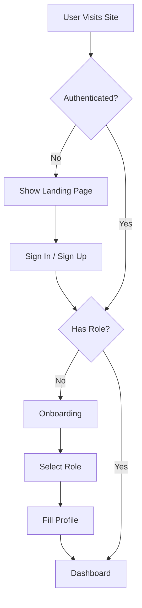

# 🎓 School Management System (AI-Powered)

An AI-powered school management application built with Next.js 15, TypeScript, Prisma, and Clerk authentication. Provides role-based dashboards for students, teachers, and administrators.

## 🚀 Current Status: Foundation Complete ✅

**Step 1: Foundation Strengthening** has been implemented with:
- ✅ Clerk authentication with role management
- ✅ Database schema and synchronization
- ✅ Role-based onboarding flow
- ✅ Three role-specific dashboards
- ✅ API routes for user management
- ✅ Webhook integration
- ✅ Type-safe authentication utilities

## 📋 Features

### Authentication & Authorization
- **Clerk Integration**: Secure authentication with email/password
- **Role-Based Access Control**: Three roles (Student, Teacher, Admin)
- **Onboarding Flow**: Guided setup for new users
- **Profile Management**: Role-specific profile creation

### Dashboards

#### 👩‍🎓 Student Dashboard
- View personal information (ID, class, section)
- Quick access to:
  - Attendance records
  - Homework assignments
  - Exam results
  - Messages
  - Complaints
  - School events

#### 👩‍🏫 Teacher Dashboard
- View teacher information (ID, subject, qualification)
- Quick access to:
  - Assigned classes
  - Mark attendance
  - Create homework
  - Upload results
  - View complaints
  - Class analytics

#### 🧑‍💼 Admin Dashboard
- System statistics overview
- Quick access to:
  - Manage students
  - Manage teachers
  - Fee management
  - Event scheduling
  - Complaint resolution
  - Generate reports

## 🛠️ Tech Stack

- **Framework**: Next.js 15 (App Router)
- **Language**: TypeScript
- **Database**: SQLite (dev) / PostgreSQL (production)
- **ORM**: Prisma
- **Authentication**: Clerk
- **Styling**: Tailwind CSS v4
- **UI Components**: Shadcn UI
- **Icons**: Lucide React

## 📦 Installation

### Prerequisites
- Node.js 20+
- npm or pnpm
- Clerk account ([clerk.com](https://clerk.com))

### Setup Steps

1. **Clone and Install**
```bash
git clone <your-repo>
cd school_app
npm install
```

2. **Configure Environment Variables**

Create `.env.local` file:
```env
# Database
DATABASE_URL=file:./dev.db

# Clerk Authentication
NEXT_PUBLIC_CLERK_PUBLISHABLE_KEY=pk_test_your_key
CLERK_SECRET_KEY=sk_test_your_key
CLERK_WEBHOOK_SECRET=whsec_your_webhook_secret

# Clerk URLs
NEXT_PUBLIC_CLERK_SIGN_IN_URL=/sign-in
NEXT_PUBLIC_CLERK_SIGN_UP_URL=/sign-up
NEXT_PUBLIC_CLERK_AFTER_SIGN_IN_URL=/dashboard
NEXT_PUBLIC_CLERK_AFTER_SIGN_UP_URL=/onboarding
```

3. **Set Up Database**
```bash
# Generate Prisma client
npx prisma generate

# Run migrations
npx prisma migrate dev

# Seed with sample data
npm run db:seed
```

4. **Configure Clerk Webhooks**
- Go to Clerk Dashboard → Webhooks
- Add endpoint: `https://your-domain.com/api/webhooks/clerk`
- Subscribe to: `user.created`, `user.updated`, `user.deleted`
- Copy signing secret to `.env.local`

5. **Run Development Server**
```bash
npm run dev
```

Visit `http://localhost:3000`

## 🧪 Testing

### Sample Credentials (After Seeding)

```
Admin:     admin@school.edu / admin123
Teacher 1: teacher1@school.edu / teacher123
Teacher 2: teacher2@school.edu / teacher123
Student 1: student1@school.edu / student123
Student 2: student2@school.edu / student123
Student 3: student3@school.edu / student123
```

### Test Flows

**New User Registration:**
1. Go to `/sign-up`
2. Create account
3. Complete onboarding (select role, fill profile)
4. Access role-specific dashboard

**Existing User Login:**
1. Go to `/sign-in`
2. Login with credentials
3. Automatic redirect to dashboard

## 📁 Project Structure

```
school_app/
├── app/
│   ├── api/
│   │   ├── user/
│   │   │   ├── role/route.ts
│   │   │   └── profile/route.ts
│   │   └── webhooks/
│   │       └── clerk/route.ts
│   ├── dashboard/
│   │   ├── layout.tsx
│   │   ├── page.tsx
│   │   ├── student/page.tsx
│   │   ├── teacher/page.tsx
│   │   └── admin/page.tsx
│   ├── onboarding/page.tsx
│   ├── sign-in/[[...sign-in]]/page.tsx
│   ├── sign-up/[[...sign-up]]/page.tsx
│   ├── layout.tsx
│   ├── page.tsx
│   └── globals.css
├── components/
│   ├── ui/                    # Shadcn UI components
│   └── onboarding-form.tsx
├── lib/
│   ├── auth.ts               # Authentication utilities
│   ├── prisma.ts             # Prisma client
│   └── utils.ts              # Utility functions
├── prisma/
│   ├── schema.prisma         # Database schema
│   ├── migrations/
│   └── seed-simple.js        # Database seeding
├── docs/
│   ├── school_management.md  # Project requirements
│   └── STEP1_SETUP.md       # Setup guide
├── middleware.ts             # Route protection
├── .env.local               # Environment variables
└── package.json
```

## 🔐 Authentication Flow



## 🎯 API Routes

### User Management
- `GET /api/user/role` - Get current user's role
- `POST /api/user/role` - Set user role
- `GET /api/user/profile` - Get user profile
- `POST /api/user/profile` - Create user profile

### Webhooks
- `POST /api/webhooks/clerk` - Clerk webhook handler

## 🔧 Utility Functions

### `getCurrentUser()`
```typescript
const user = await getCurrentUser()
// Returns: { id, clerkId, email, role, fullName, studentData?, teacherData? }
```

### `requireRole(role)`
```typescript
// Protect API routes
const user = await requireRole('admin')
```

### `hasAnyRole(roles)`
```typescript
// Check multiple roles
const hasAccess = await hasAnyRole(['teacher', 'admin'])
```

## 📊 Database Schema

### Core Tables
- **User** - Base authentication table
- **Student** - Student profiles
- **Teacher** - Teacher profiles
- **Class** - Class information
- **Attendance** - Attendance records
- **Subject** - Subject definitions
- **Result** - Exam results
- **Homework** - Homework assignments
- **Complaint** - Complaint system
- **Event** - School events
- **Fee** - Fee management
- **Notification** - User notifications
- **ChatMessage** - Messaging system

## 🚧 Roadmap

### Phase 1: Foundation ✅ (Current)
- [x] Authentication & role management
- [x] Database schema
- [x] Onboarding flow
- [x] Basic dashboards

### Phase 2: Core Features (Next)
- [ ] Attendance management
- [ ] Homework system
- [ ] Results/grades management
- [ ] Complaint system
- [ ] Event calendar
- [ ] Fee management

### Phase 3: Communication
- [ ] Real-time chat (Socket.io)
- [ ] Notifications system
- [ ] Email integration

### Phase 4: AI Integration
- [ ] Complaint routing agent
- [ ] Performance analysis agent
- [ ] Teacher assistant agent
- [ ] Admin insights agent

### Phase 5: Advanced Features
- [ ] Analytics & reporting
- [ ] Mobile responsiveness
- [ ] File uploads
- [ ] Export functionality

## 🐛 Troubleshooting

### Common Issues

**Webhook not working:**
- Verify `CLERK_WEBHOOK_SECRET` is correct
- Ensure endpoint is publicly accessible
- Check Clerk Dashboard webhook logs

**Database errors:**
- Run `npx prisma generate`
- Verify `DATABASE_URL` in `.env.local`
- Check database file exists

**Redirect loops:**
- Clear browser cookies
- Verify user has role AND profile
- Check middleware configuration

## 📝 Scripts

```bash
npm run dev          # Start development server
npm run build        # Build for production
npm run start        # Start production server
npm run db:seed      # Seed database
npm run db:reset     # Reset and reseed database
```

## 🤝 Contributing

This is a learning/portfolio project. Feel free to fork and customize for your needs.

## 📄 License

MIT License - See LICENSE file for details

## 📧 Contact

For questions or feedback, please open an issue in the repository.

---

**Built with ❤️ using Next.js, TypeScript, and Clerk**
