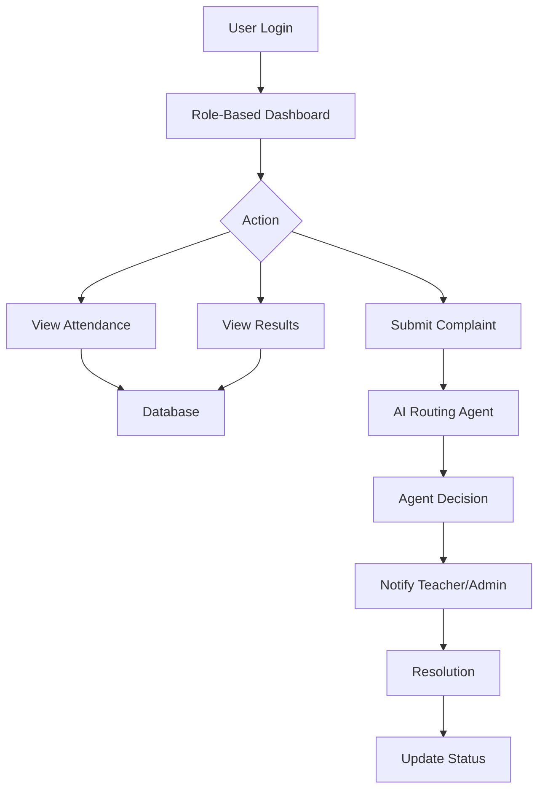
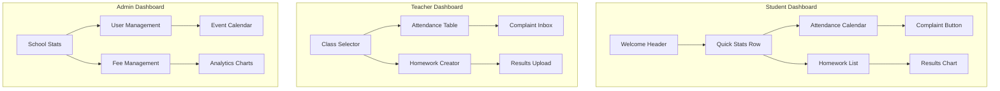
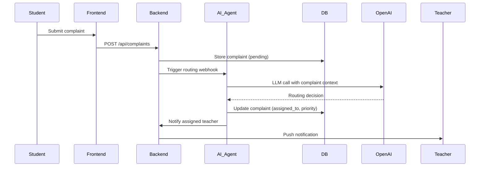

# 📚 School Management System (AI Powered)

## 🧾 Project Overview

This project is an AI-powered School Management Application designed for three main users:

* Students
* Teachers
* Admin

The system will provide dashboards, communication, reporting, and AI-powered automation to improve school operations.

---

# 🎯 Objectives

* Create a user-friendly application
* Provide separate dashboards for each role
* Enable communication between students, teachers, parents, and admin
* Automate processes using AI agents

---

# 🧩 Core Features

## 👩‍🎓 Student Dashboard

* Login using Student ID
* View personal details (class, section)
* Attendance tracking
* Progress reports
* Homework & daily updates
* Teacher remarks & complaints
* Chat with teachers/admin

## 👩‍🏫 Teacher Dashboard

* Manage assigned classes & subjects
* Mark attendance
* Upload homework & results
* Add remarks/complaints
* Communicate with students & admin
* View salary records

## 🧑‍💼 Admin Dashboard

* Manage students & teachers
* View complaints
* Event scheduling
* Fee management
* Weekly & monthly reports

---

# 🤖 AI Features (Agentic System)

## 1. Complaint Routing Agent

* Automatically routes complaints to teacher or admin

## 2. Performance Analysis Agent

* Analyzes student progress
* Suggests improvements

## 3. Teacher Assistant Agent

* Generates remarks
* Suggests homework

## 4. Admin Insights Agent

* Generates reports
* Identifies weak students
* Tracks fee defaulters

---

# 🛠️ Tech Stack

## Frontend

* Next.js
* TypeScript
* Tailwind CSS
* Shadcn UI

## Backend

* Next.js API Routes

## Database

* PostgreSQL (Recommended)

## Authentication

* NextAuth / Clerk

## AI Integration

* OpenAI SDK
* Multi-Agent System

---

# 📋 Detailed Technical Specifications

## System Architecture
- **Frontend**: Next.js 15 (App Router) with TypeScript, Tailwind CSS, Shadcn UI components
- **Backend**: Next.js API Routes (RESTful) with server actions for mutations
- **Database**: PostgreSQL with Prisma ORM for type-safe queries
- **Authentication**: Clerk (recommended) for multi-role auth with custom claims
- **Real-time**: Socket.io for chat and notifications
- **AI Integration**: OpenAI GPT-4/3.5-turbo for agent reasoning, LangChain for orchestration
- **Deployment**: Vercel for frontend/backend, Supabase or Neon for PostgreSQL
- **Monitoring**: Logging with Winston, error tracking with Sentry

## Development Environment
- Node.js 20+, pnpm package manager
- Docker for local PostgreSQL and Redis
- Environment variables for API keys and secrets
- ESLint, Prettier, Husky for code quality

## Security Considerations
- Role-based access control (RBAC) at API and UI level
- SQL injection prevention via Prisma
- XSS protection via React escaping
- Rate limiting on API routes
- HTTPS enforcement

## Performance Optimizations
- Static generation for public pages
- Incremental static regeneration for dashboards
- Database indexing on foreign keys and frequently queried columns
- Caching with Redis for session data and frequent queries
- Image optimization with Next.js Image component

# 🗂️ Database Schema (Expanded)

## Tables & Relationships

### Users (Base for authentication)
- `id` UUID PRIMARY KEY
- `email` VARCHAR(255) UNIQUE NOT NULL
- `password_hash` VARCHAR(255)
- `role` ENUM('student', 'teacher', 'admin') NOT NULL
- `created_at` TIMESTAMP DEFAULT NOW()
- `updated_at` TIMESTAMP DEFAULT NOW()

### Students
- `id` UUID PRIMARY KEY REFERENCES users(id) ON DELETE CASCADE
- `student_id` VARCHAR(20) UNIQUE NOT NULL
- `full_name` VARCHAR(100) NOT NULL
- `class` VARCHAR(10) NOT NULL (e.g., "10th")
- `section` CHAR(1) NOT NULL (e.g., "A")
- `date_of_birth` DATE
- `parent_name` VARCHAR(100)
- `parent_phone` VARCHAR(15)
- `address` TEXT
- `enrollment_date` DATE NOT NULL

### Teachers
- `id` UUID PRIMARY KEY REFERENCES users(id) ON DELETE CASCADE
- `teacher_id` VARCHAR(20) UNIQUE NOT NULL
- `full_name` VARCHAR(100) NOT NULL
- `subject` VARCHAR(50) NOT NULL
- `qualification` VARCHAR(100)
- `joining_date` DATE NOT NULL
- `salary` DECIMAL(10,2)

### Classes
- `id` UUID PRIMARY KEY
- `class_name` VARCHAR(10) UNIQUE NOT NULL (e.g., "10th")
- `section` CHAR(1) NOT NULL
- `teacher_id` UUID REFERENCES teachers(id) ON DELETE SET NULL
- `room_number` VARCHAR(10)

### Attendance
- `id` UUID PRIMARY KEY
- `student_id` UUID REFERENCES students(id) ON DELETE CASCADE
- `date` DATE NOT NULL
- `status` ENUM('present', 'absent', 'late', 'excused') NOT NULL
- `marked_by` UUID REFERENCES teachers(id) ON DELETE SET NULL
- `remarks` TEXT
- UNIQUE(student_id, date)

### Subjects
- `id` UUID PRIMARY KEY
- `name` VARCHAR(50) NOT NULL
- `code` VARCHAR(10) UNIQUE NOT NULL
- `description` TEXT

### Results (Exam Scores)
- `id` UUID PRIMARY KEY
- `student_id` UUID REFERENCES students(id) ON DELETE CASCADE
- `subject_id` UUID REFERENCES subjects(id) ON DELETE CASCADE
- `exam_type` VARCHAR(20) (e.g., "midterm", "final")
- `marks_obtained` DECIMAL(5,2)
- `total_marks` DECIMAL(5,2) DEFAULT 100
- `grade` CHAR(2)
- `exam_date` DATE
- UNIQUE(student_id, subject_id, exam_type)

### Homework
- `id` UUID PRIMARY KEY
- `teacher_id` UUID REFERENCES teachers(id) ON DELETE CASCADE
- `class` VARCHAR(10) NOT NULL
- `section` CHAR(1) NOT NULL
- `subject` VARCHAR(50) NOT NULL
- `title` VARCHAR(200) NOT NULL
- `description` TEXT
- `due_date` DATE
- `attachment_url` VARCHAR(500)
- `created_at` TIMESTAMP DEFAULT NOW()

### Complaints
- `id` UUID PRIMARY KEY
- `from_user_id` UUID REFERENCES users(id) ON DELETE CASCADE
- `to_user_id` UUID REFERENCES users(id) ON DELETE CASCADE
- `category` ENUM('academic', 'behavior', 'facility', 'other') NOT NULL
- `message` TEXT NOT NULL
- `status` ENUM('pending', 'in_progress', 'resolved', 'dismissed') DEFAULT 'pending'
- `priority` ENUM('low', 'medium', 'high') DEFAULT 'medium'
- `created_at` TIMESTAMP DEFAULT NOW()
- `resolved_at` TIMESTAMP
- `assigned_to` UUID REFERENCES users(id) ON DELETE SET NULL

### Events
- `id` UUID PRIMARY KEY
- `title` VARCHAR(200) NOT NULL
- `description` TEXT
- `event_date` DATE NOT NULL
- `event_time` TIME
- `location` VARCHAR(100)
- `organizer` VARCHAR(100)
- `audience` ENUM('all', 'students', 'teachers', 'parents') DEFAULT 'all'

### Fees
- `id` UUID PRIMARY KEY
- `student_id` UUID REFERENCES students(id) ON DELETE CASCADE
- `term` VARCHAR(20) NOT NULL (e.g., "Q1 2025")
- `amount` DECIMAL(10,2) NOT NULL
- `due_date` DATE NOT NULL
- `paid_amount` DECIMAL(10,2) DEFAULT 0
- `payment_status` ENUM('pending', 'partial', 'paid', 'overdue') DEFAULT 'pending'
- `payment_date` DATE
- `transaction_id` VARCHAR(100)

### Notifications
- `id` UUID PRIMARY KEY
- `user_id` UUID REFERENCES users(id) ON DELETE CASCADE
- `title` VARCHAR(200) NOT NULL
- `message` TEXT NOT NULL
- `type` ENUM('info', 'warning', 'alert', 'reminder')
- `read` BOOLEAN DEFAULT FALSE
- `created_at` TIMESTAMP DEFAULT NOW()

### Chat Messages
- `id` UUID PRIMARY KEY
- `sender_id` UUID REFERENCES users(id) ON DELETE CASCADE
- `receiver_id` UUID REFERENCES users(id) ON DELETE CASCADE
- `message` TEXT NOT NULL
- `timestamp` TIMESTAMP DEFAULT NOW()
- `read` BOOLEAN DEFAULT FALSE

## Indexes
- Index on `attendance(student_id, date)` for quick lookup
- Index on `results(student_id, subject_id)` for performance reports
- Index on `complaints(status, priority)` for agent routing
- Index on `fees(student_id, payment_status)` for fee defaulters tracking

---

# 🌐 API Endpoints & Data Flow

## Authentication & Users
- `POST /api/auth/login` – Login with email/password, returns JWT token
- `POST /api/auth/register` – Register new user (admin only)
- `GET /api/auth/me` – Get current user profile
- `PUT /api/auth/update` – Update user profile
- `GET /api/users` – List users (admin only)
- `GET /api/users/:id` – Get user by ID
- `PUT /api/users/:id` – Update user (admin)

## Students
- `GET /api/students` – List all students (with filters)
- `GET /api/students/:id` – Get student details
- `POST /api/students` – Create new student (admin)
- `PUT /api/students/:id` – Update student
- `DELETE /api/students/:id` – Delete student (admin)
- `GET /api/students/:id/attendance` – Get attendance records
- `GET /api/students/:id/results` – Get academic results
- `GET /api/students/:id/complaints` – Get complaints by/for student

## Teachers
- `GET /api/teachers` – List teachers
- `GET /api/teachers/:id` – Get teacher details
- `POST /api/teachers` – Add teacher (admin)
- `PUT /api/teachers/:id` – Update teacher
- `GET /api/teachers/:id/classes` – Get assigned classes

## Attendance
- `POST /api/attendance/mark` – Mark attendance (teacher)
- `GET /api/attendance` – View attendance (with date/class filters)
- `PUT /api/attendance/:id` – Update attendance entry
- `GET /api/attendance/report` – Generate attendance report (admin)

## Homework
- `GET /api/homework` – List homework (student/teacher view)
- `POST /api/homework` – Create homework (teacher)
- `PUT /api/homework/:id` – Update homework
- `DELETE /api/homework/:id` – Delete homework
- `GET /api/homework/submit` – Student submit homework (future)

## Complaints
- `GET /api/complaints` – List complaints (role‑based filtering)
- `POST /api/complaints` – Create a new complaint
- `PUT /api/complaints/:id` – Update complaint status/priority
- `GET /api/complaints/stats` – Complaint statistics (admin)
- `POST /api/complaints/:id/assign` – Assign complaint to agent/admin

## Results & Academics
- `GET /api/results` – Get results (student/teacher)
- `POST /api/results` – Upload results (teacher/admin)
- `PUT /api/results/:id` – Update result entry
- `GET /api/results/analysis` – Performance analysis (AI agent)

## Events
- `GET /api/events` – List upcoming events
- `POST /api/events` – Create event (admin)
- `PUT /api/events/:id` – Update event
- `DELETE /api/events/:id` – Delete event

## Fees
- `GET /api/fees` – List fee records (student/admin)
- `POST /api/fees` – Create fee entry (admin)
- `PUT /api/fees/:id/pay` – Record payment
- `GET /api/fees/report` – Fee defaulters report

## Notifications
- `GET /api/notifications` – Get user notifications
- `POST /api/notifications` – Send notification (admin/system)
- `PUT /api/notifications/:id/read` – Mark as read

## Chat
- `GET /api/chat/conversations` – List conversations
- `GET /api/chat/messages/:userId` – Get messages with a user
- `POST /api/chat/send` – Send message
- WebSocket `/ws/chat` – Real‑time messaging

## AI Agents
- `POST /api/ai/complaint-routing` – Route a complaint (internal)
- `POST /api/ai/performance-analysis` – Analyze student performance
- `POST /api/ai/generate-remarks` – Generate teacher remarks
- `POST /api/ai/admin-insights` – Generate admin insights report

## Data Flow Diagram


---

# 🎨 UI Wireframes & Component Structure

## Layout Components
- **RootLayout**: App-wide layout with header, sidebar, and main content
- **Header**: Contains logo, user profile, notifications bell, logout
- **Sidebar**: Role‑based navigation (collapsible on mobile)
- **MainContent**: Responsive container for dashboard pages

## Authentication Pages
- **LoginPage**: Role selection (Student/Teacher/Admin) + credentials
- **RegisterPage**: Admin‑only user creation
- **ForgotPasswordPage**: Password reset flow

## Dashboard Pages
### Student Dashboard
- **StudentOverview**: Welcome card, quick stats (attendance %, pending homework)
- **AttendanceCard**: Monthly calendar view with present/absent markers
- **HomeworkList**: Upcoming homework with due dates and status
- **ResultsChart**: Subject‑wise performance bar chart
- **ComplaintForm**: Modal/form to submit a complaint
- **TeacherRemarks**: List of recent teacher remarks

### Teacher Dashboard
- **TeacherOverview**: Classes assigned, pending attendance, unread complaints
- **ClassSelector**: Dropdown to select class/section
- **AttendanceMarking**: Table of students with checkboxes for marking attendance
- **HomeworkCreator**: Form to assign homework with attachment upload
- **ComplaintInbox**: List of complaints with status and priority badges
- **ResultsUpload**: CSV upload or manual entry for exam results

### Admin Dashboard
- **AdminOverview**: School stats (total students, teachers, pending fees)
- **UserManagement**: CRUD table for students/teachers
- **FeeManagement**: Fee records with payment status filters
- **EventCalendar**: Full‑calendar view for school events
- **AnalyticsCharts**: Graphs for attendance trends, complaint resolution rate
- **SystemSettings**: Configuration for academic year, terms, etc.

## Shared Components
- **DataTable**: Reusable table with sorting, pagination, filters
- **Card**: Styled container for any content
- **Badge**: Status indicators (present/absent, pending/resolved)
- **Modal**: Reusable modal dialog
- **Toast**: Notification toasts for actions
- **LoadingSpinner**: For async operations

## Wireframe Sketches (Mermaid)


## Responsive Design
- Mobile‑first approach using Tailwind breakpoints
- Sidebar collapses to hamburger menu on small screens
- Tables become scrollable horizontally
- Cards stack vertically on mobile

## Design System
- **Colors**: Primary blue (#3b82f6), Success green (#10b981), Warning amber (#f59e0b), Danger red (#ef4444)
- **Typography**: Inter font family, sizes based on Tailwind scale
- **Spacing**: 4px base unit, consistent padding/margin
- **Shadows**: Subtle shadows for cards, deeper for modals

---

# 🤖 AI Agent Implementation Details

## Agent Architecture
- **Orchestrator Pattern**: Central coordinator that routes tasks to specialized agents
- **Agent Types**: Four specialized agents (Complaint Routing, Performance Analysis, Teacher Assistant, Admin Insights)
- **Communication**: Agents communicate via message queue (Redis) or direct API calls
- **State Management**: Each agent maintains its own context and memory (vector store for historical data)

## 1. Complaint Routing Agent
### Purpose
Automatically classify incoming complaints and route them to the appropriate teacher or admin.

### Implementation
- **Input**: Complaint text, category, sender role
- **Processing**:
  1. Use OpenAI GPT‑4‑turbo to analyze complaint content
  2. Classify urgency (low/medium/high) and topic (academic, behavioral, facility)
  3. Match with teacher expertise (from database) or admin jurisdiction
  4. Decide recipient based on load balancing and past resolution rate
- **Output**: Assign `to_user_id` and set `priority` in complaints table
- **Trigger**: On new complaint creation (webhook or database trigger)
- **Fallback**: If confidence < 80%, flag for manual review by admin

### Prompts (Example)
```
You are a school complaint routing assistant. Analyze the following complaint and decide which teacher or admin should handle it.

Complaint: {complaint_text}
Category: {category}
Sender: {sender_role}

Available teachers: {list_of_teachers_with_subjects}

Respond with JSON: { "assigned_to": "teacher_id", "priority": "high/medium/low", "reason": "brief explanation" }
```

## 2. Performance Analysis Agent
### Purpose
Analyze student performance across subjects and suggest improvements.

### Implementation
- **Input**: Student ID, historical results, attendance records
- **Processing**:
  1. Fetch student data (results, attendance, homework completion)
  2. Compute trends (improving/declining) per subject
  3. Use GPT‑4 to generate natural language insights and recommendations
  4. Identify at‑risk students (falling below threshold)
- **Output**: Report stored in database, notifications to teacher/parent
- **Schedule**: Runs weekly via cron job

### Data Sources
- Results table (marks per subject)
- Attendance table (absenteeism)
- Homework submission status

## 3. Teacher Assistant Agent
### Purpose
Assist teachers by generating remarks, suggesting homework, and answering routine queries.

### Implementation
- **Input**: Class performance data, topic, teacher request
- **Capabilities**:
  - **Remark Generation**: Given student behavior/performance, produce constructive remarks
  - **Homework Suggestions**: Based on curriculum and recent topics, propose homework questions
  - **FAQ Answering**: Answer common teacher questions about policies, schedules
- **Integration**: Slack‑like chat interface within teacher dashboard
- **Model**: Fine‑tuned GPT‑3.5‑turbo with teacher‑specific knowledge base

## 4. Admin Insights Agent
### Purpose
Provide admin with actionable insights: fee defaulters, weak students, attendance trends.

### Implementation
- **Input**: Aggregated school‑wide data
- **Processing**:
  1. SQL queries to identify fee defaulters (unpaid fees > 30 days)
  2. Machine learning clustering to detect at‑risk student groups
  3. Time‑series analysis of attendance across classes
  4. Natural language report generation
- **Output**: Dashboard widgets, email summaries, alert notifications
- **Schedule**: Daily at 8 AM

## Technical Stack for AI
- **LLM Provider**: OpenAI API (GPT‑4‑turbo for routing, GPT‑3.5‑turbo for lighter tasks)
- **Embeddings**: OpenAI text‑embedding‑3‑small for semantic search
- **Vector Database**: Pinecone or pgvector (PostgreSQL extension) for storing historical complaints/remarks
- **Orchestration**: LangChain for agent chains, CrewAI for multi‑agent collaboration
- **Caching**: Redis for storing intermediate results and rate limiting
- **Monitoring**: LangSmith for tracing agent execution

## Cost & Scaling Considerations
- Estimate ~10k tokens per day for a medium‑sized school
- Use cheaper models (GPT‑3.5) where possible, GPT‑4 only for critical routing
- Implement request queuing and retry logic for API failures
- Cache frequent queries (e.g., teacher list) to reduce token usage

## Integration with Backend
- Each agent exposes a REST endpoint (e.g., `/api/ai/route-complaint`)
- Agents are triggered via webhooks (e.g., `POST /api/webhooks/new-complaint`)
- Asynchronous processing using background jobs (BullMQ with Redis)
- Results stored in `agent_logs` table for auditability

## Example Workflow: Complaint Routing


---

# 📅 Detailed Project Timeline & Milestones

## 🗓️ Timeline Overview (12‑Week Development Cycle)

| Week | Phase | Key Deliverables | Dependencies |
|------|-------|------------------|--------------|
| **Week 1‑2** | **Foundation** | - Next.js project with TypeScript<br>- PostgreSQL + Prisma setup<br>- Authentication (Clerk) with role‑based routes<br>- Basic layout (header, sidebar) | None |
| **Week 3‑4** | **Student Dashboard** | - Student profile page<br>- Attendance calendar view<br>- Homework listing component<br>- Complaint submission form | Authentication, Database |
| **Week 5‑6** | **Teacher Dashboard** | - Class selector & attendance marking UI<br>- Homework creation form<br>- Complaint inbox with filters<br>- Results upload interface | Student dashboard APIs |
| **Week 7‑8** | **Admin Dashboard** | - User management CRUD<br>- Fee management table<br>- Event calendar (FullCalendar integration)<br>- Analytics charts (Chart.js) | Teacher dashboard, Database |
| **Week 9** | **Core Systems** | - Attendance reporting API<br>- Complaint workflow (status updates)<br>- Real‑time notifications (Socket.io)<br>- Homework deadline reminders | All dashboards |
| **Week 10** | **AI Integration** | - Complaint routing agent (OpenAI)<br>- Performance analysis agent<br>- Teacher assistant remark generator<br>- Admin insights report generator | Core systems, OpenAI API |
| **Week 11** | **UI/UX Polish** | - Mobile responsiveness<br>- Dark/light theme<br>- Loading states & error boundaries<br>- Graph dashboards (recharts) | All frontend components |
| **Week 12** | **Testing & Deployment** | - End‑to‑end tests (Cypress)<br>- Performance optimization<br>- Deployment to Vercel + Supabase<br>- Documentation & user guides | All features |

## 🎯 Milestones

### Milestone 1: MVP (End of Week 4)
- Students can log in, view attendance, submit complaints
- Teachers can mark attendance, create homework
- Admin can view user lists
- Basic UI functional

### Milestone 2: Core Platform (End of Week 8)
- All three dashboards fully operational
- Attendance, homework, complaints, events, fees CRUD
- Real‑time notifications
- Role‑based access control enforced

### Milestone 3: AI‑Powered (End of Week 10)
- Complaint routing automated
- Performance analysis reports generated
- Teacher assistant generates remarks
- Admin insights dashboard with AI‑driven alerts

### Milestone 4: Production Ready (End of Week 12)
- Fully tested, responsive, deployed
- Monitoring & error tracking set up
- User documentation completed
- Ready for pilot school rollout

## 🔗 Dependencies & Risks

### Technical Dependencies
- OpenAI API availability & cost
- PostgreSQL performance with large datasets
- Real‑time WebSocket scalability
- Third‑party services (Clerk, Vercel, Supabase)

### Mitigation Strategies
- Use fallback rules if AI API fails
- Implement database indexing and query optimization
- Use Socket.io with Redis adapter for scaling
- Monitor API usage with budget alerts

## 📈 Success Metrics
- **User Adoption**: 80% of teachers using attendance marking within first month
- **System Performance**: Page load < 2 seconds, API response < 200ms
- **AI Accuracy**: Complaint routing accuracy > 85% compared to manual assignment
- **Uptime**: 99.5% availability during school hours

## 👥 Team & Roles
- **Frontend Developer**: 2 (Next.js, Tailwind, state management)
- **Backend Developer**: 1 (API, database, authentication)
- **AI/ML Engineer**: 1 (agent design, prompt engineering, integration)
- **QA/Testing**: 1 (manual & automated testing)
- **Project Manager**: 1 (timeline, coordination, delivery)

---

# 📊 Additional Features & Future Enhancements

## Immediate Post‑MVP
- **Push Notifications**: Browser push notifications for real‑time updates
- **SMS/Email Integration**: Notify parents about attendance, fees, events
- **Advanced Analytics**: Predictive analytics for student performance trends
- **Parent Portal**: Separate dashboard for parents to track child’s progress
- **Bulk Import/Export**: CSV import for students, teachers, results

## Medium‑Term (3‑6 months)
- **Mobile App**: React Native cross‑platform app for teachers/parents
- **Voice Notes**: Teachers can record voice remarks for students
- **Document Storage**: Upload and manage syllabi, notes, circulars
- **Integration with LMS**: Moodle/Google Classroom sync
- **Multi‑School Support**: SaaS model for multiple institutions

## Long‑Term Vision
- **Predictive Dropout Alert**: ML model to identify at‑risk students
- **Automated Report Card Generation**: AI‑generated personalized report cards
- **Virtual Assistant Chatbot**: 24/7 Q&A for students and parents
- **Gamification**: Badges and rewards for student engagement
- **Blockchain for Certificates**: Immutable record of achievements

---

# ⚠️ Challenges & Mitigation Strategies

## Technical Challenges
1. **Role‑Based Access Control (RBAC)**
   - Complex permission matrix across three user roles
   - Mitigation: Use middleware (Next.js) + database‑level row‑level security

2. **Real‑Time Data Updates**
   - Live attendance marking, chat, notifications require WebSocket scaling
   - Mitigation: Socket.io with Redis adapter, fallback to polling for edge cases

3. **Database Performance**
   - Large datasets (attendance, results) with frequent reads/writes
   - Mitigation: Indexing, query optimization, read replicas, connection pooling

4. **AI Integration Complexity**
   - Latency, cost, and reliability of external LLM APIs
   - Mitigation: Caching, fallback rules, queue‑based processing, budget monitoring

5. **Data Security & Privacy**
   - Student data protection (GDPR, COPPA compliance)
   - Mitigation: Encryption at rest & transit, audit logs, access reviews

6. **Cross‑Platform Responsiveness**
   - Consistent UI across desktop, tablet, mobile
   - Mitigation: Mobile‑first CSS, component testing on multiple viewports

## Operational Challenges
1. **User Adoption**
   - Teachers/students resistant to new technology
   - Mitigation: Training sessions, intuitive UI, gradual rollout with feedback

2. **Integration with Legacy Systems**
   - Existing school management software may not have APIs
   - Mitigation: CSV import/export, manual data entry bridges

3. **Cost Management**
   - Cloud hosting, AI API, SMS/email services can become expensive
   - Mitigation: Usage caps, cost‑effective providers, open‑source alternatives

4. **Maintenance & Support**
   - Ongoing bug fixes, feature requests, updates
   - Mitigation: Comprehensive documentation, automated testing, dedicated support channel

---

# 🏁 Conclusion

This project can evolve into a full SaaS product. Start with basic features and gradually move towards advanced AI-powered functionalities.

---

# 📄 Markdown Version (README.md)

```md
# School Management System (AI Powered)

## Overview
An AI‑powered school management system providing separate dashboards for students, teachers, and administrators. The platform automates attendance, homework, complaints, fee management, and integrates four specialized AI agents to improve school operations.

## Core Features
### Student Dashboard
- View attendance calendar, homework, results
- Submit complaints, receive teacher remarks
- Real‑time chat with teachers/admin

### Teacher Dashboard
- Mark attendance, assign homework, upload results
- Manage complaints, generate AI‑assisted remarks
- View class performance analytics

### Admin Dashboard
- Manage students, teachers, classes, fees
- Schedule events, view school‑wide reports
- Monitor AI agent performance and insights

### AI Agents
1. **Complaint Routing Agent** – Automatically routes complaints to appropriate staff
2. **Performance Analysis Agent** – Identifies at‑risk students and suggests interventions
3. **Teacher Assistant Agent** – Generates remarks and homework suggestions
4. **Admin Insights Agent** – Produces reports on fee defaulters, attendance trends, etc.

## Tech Stack
- **Frontend**: Next.js 15 (App Router), TypeScript, Tailwind CSS, Shadcn UI
- **Backend**: Next.js API Routes, Prisma ORM, PostgreSQL
- **Authentication**: Clerk (multi‑role RBAC)
- **Real‑time**: Socket.io for chat & notifications
- **AI**: OpenAI GPT‑4/3.5‑turbo, LangChain, pgvector
- **Deployment**: Vercel, Supabase, Redis

## Development Timeline (12 Weeks)
- **Weeks 1‑2**: Foundation (project setup, auth, database)
- **Weeks 3‑4**: Student dashboard
- **Weeks 5‑6**: Teacher dashboard
- **Weeks 7‑8**: Admin dashboard
- **Week 9**: Core systems (attendance, complaints, notifications)
- **Week 10**: AI integration
- **Week 11**: UI/UX polish
- **Week 12**: Testing & deployment

## Getting Started
1. Clone the repository
2. Install dependencies: `pnpm install`
3. Set up environment variables (`.env.local`)
4. Run database migrations: `npx prisma migrate dev`
5. Start dev server: `pnpm dev`

## License
MIT – open for educational and commercial use.

## Contact
For questions or contributions, open an issue or reach out to the project maintainers.
```

---

✅ This document can be used as your project blueprint before development.
